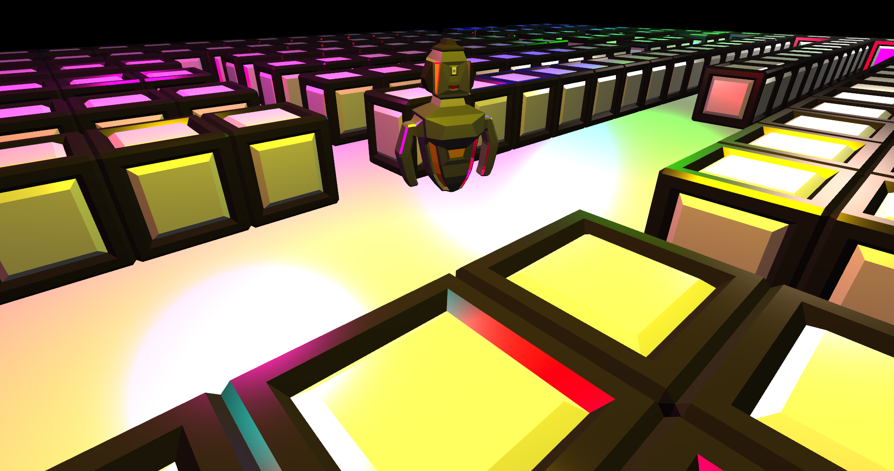
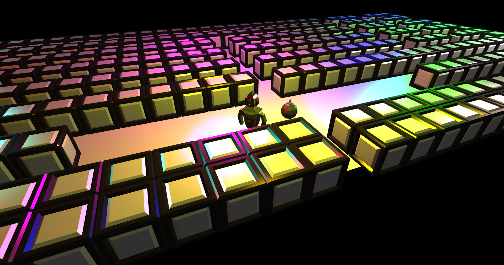

<h1>Bomberman!</h1>
<h2>This is my attempt to rewrite in clean way my old project game bomberman</h2>
This project is still WIP. I use C++ and OpenGL to render things. All models (bomb, cube, bomberman) were created by me in Blender.

Libs I use:
<ul>
  <li>GLFW</li>
  <li>GLEW</li>
  <li>Assimp</li>
  <li>Freetype</li>
  <li>fmt</li>
</ul>

<h3>Screens from previous project:</h3>
</img>
</img>